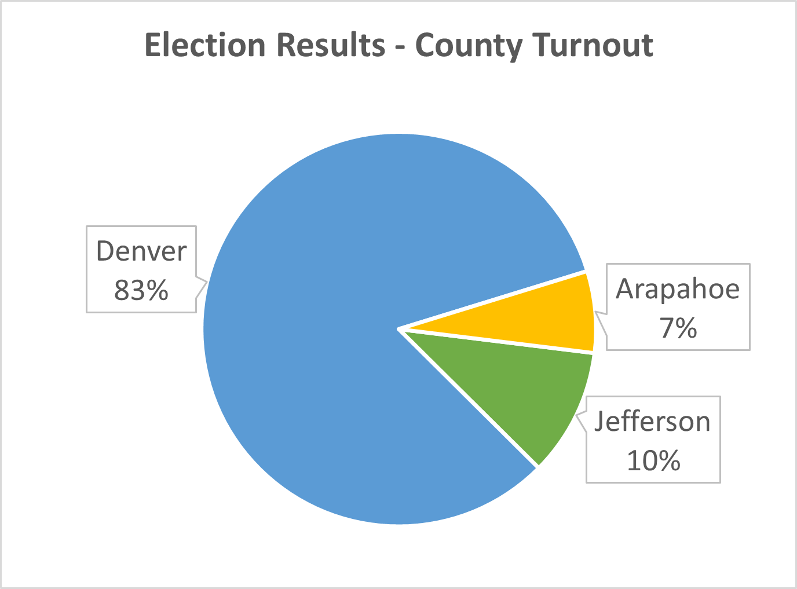
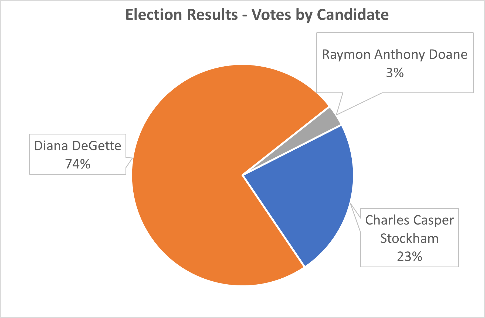

# Analysis of Colorado Congressional Election

## Overview of Election Audit
In this election audit, we use a python script to determine and report the total number of votes, the number of votes and percentage of votes for each candidate, and the winner of the election based on the popular vote. In addition, we determine and report the voter turnout of each county, the percentage of total votes for each county, and the county with the highest turnout. These results are printed to the terminal and saved as a text file. 

## Election Audit Results
* A total of 369, 711 votes were cast in this congressional election. 
    * Using a `for` loop to examine each row in the csv file, we counted the total votes using the following code:

        ```
        # Add to the total vote count  
        total_votes = total_votes + 1
        ```

* There are three counties in this congressional district: Jefferson, Denver and Arapahoe. Denver County had the highest turnout by far, with 306,055 votes and 82.8% of all the votes. Arapahoe County had the fewest votes, with 24,801 votes and 6.7% of the votes. Jefferson County had a slightly higher turnout, with 38,855 votes and 10.5% of the votes.  
    * Using a `for` loop to examine each row in the csv file, we collected the the names of the counties in a list and tallied their votes using the following code:  
    
    ```
        # 4a: Write an if statement that checks that the county does not match any existing county in the county list.
        if county_name not in county_list:

            # 4b: Add the existing county to the list of counties.
            county_list.append(county_name)

            # 4c: Begin tracking the county's vote count.
            county_votes[county_name] = 0

        # 5: Add a vote to that county's vote count.
        county_votes[county_name] += 1
     ```
    * You can see a visual breakdown of voter turnout by county below:


* As mentioned above, Denver County had the highest turnout by a very large margin.

* There were three candidates in this congressional elections: Charles Casper Stockholm, Diana Degette, and Ramon Anthony Doane. Charles received 85,213 votes, or 23% of the total votes; Diana Degette received 272,892 votes, or 73.8% of the total votes; and Raymon Anthony Doane received 11,606 votes, or 3.1% of the total votes.
    * Within the same `for` loop as used for the counties, we collected candidate names into a list and tallied their votes. 
    
        ```
        # If the candidate does not match any existing candidate add it to the candidate list
        if candidate_name not in candidate_options:

            # Add the candidate name to the candidate list.
            candidate_options.append(candidate_name)

            # And begin tracking that candidate's voter count.
            candidate_votes[candidate_name] = 0

        # Add a vote to that candidate's count
        candidate_votes[candidate_name] += 1

        ```
    * You can see a visual breakdown of candidate votes below:
 
 
* With a large majority, Diana Degette was the winner of the election. She received 272,892 votes and 73.8% of the vote.

## Election Audit Summary
This python script quickly and successfully tallies votes across multiple dimensions (candidate, counties), provides an overview of the vote distribution, and determines a winner. Because it determines the list of candidates and counties from the vote data itself, it can easily be generalized to any election where the voting data is stores as a csv file. Here are some possible useful modifications we could make for other types of elections:
* For a more complex election for multiple positions (city council, mayor, and representative), we might use a nested for loop to separate out the votes for each race. As long as a field in the csv codes for which race the vote is for, we can still easily generalize our code.
* If a vote requires an absolute majority (50% + 1) or qualified majority (defined percentage), we can add a conditional statement to ensure a winning candidate or proposition is reported to have not won or passed if they do not meet the specified requirements. 

